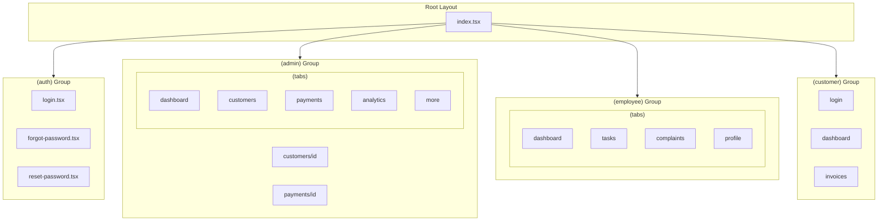

# Navigation Structure

> **Expo Router File-Based Navigation for ISP Management Mobile App**

---

## 🗺️ Navigation Map



---

## 📁 File Structure

```
app/
├── _layout.tsx                    # Root layout with providers
├── index.tsx                      # Entry point with redirect logic
│
├── (auth)/                        # Authentication screens
│   ├── _layout.tsx               # Auth stack layout
│   ├── login.tsx                 # Login screen
│   ├── forgot-password.tsx       # Forgot password
│   └── reset-password.tsx        # Reset password
│
├── (admin)/                       # Admin portal (authenticated)
│   ├── _layout.tsx               # Admin layout with sidebar
│   ├── (tabs)/                   # Bottom tab navigator
│   │   ├── _layout.tsx           # Tab bar configuration
│   │   ├── dashboard.tsx         # Dashboard tab
│   │   ├── customers.tsx         # Customers list tab
│   │   ├── payments.tsx          # Payments tab
│   │   ├── analytics.tsx         # Analytics tab
│   │   └── more.tsx              # More options tab
│   │
│   ├── customers/                # Customer screens
│   │   ├── index.tsx             # Customer list
│   │   ├── [id].tsx              # Customer detail
│   │   ├── create.tsx            # Create customer
│   │   └── [id]/
│   │       ├── edit.tsx          # Edit customer
│   │       ├── invoices.tsx      # Customer invoices
│   │       ├── payments.tsx      # Customer payments
│   │       └── complaints.tsx    # Customer complaints
│   │
│   ├── payments/
│   │   ├── index.tsx             # Payment list
│   │   ├── [id].tsx              # Payment detail
│   │   └── create.tsx            # Record payment
│   │
│   ├── invoices/
│   │   ├── index.tsx             # Invoice list
│   │   ├── [id].tsx              # Invoice detail
│   │   ├── create.tsx            # Create invoice
│   │   └── bulk.tsx              # Bulk invoice
│   │
│   ├── complaints/
│   │   ├── index.tsx             # Complaint list
│   │   ├── [id].tsx              # Complaint detail
│   │   └── create.tsx            # New complaint
│   │
│   ├── tasks/
│   │   ├── index.tsx             # Task list
│   │   ├── [id].tsx              # Task detail
│   │   └── create.tsx            # Create task
│   │
│   ├── employees/
│   │   ├── index.tsx             # Employee list
│   │   ├── [id].tsx              # Employee detail
│   │   └── create.tsx            # Create employee
│   │
│   ├── inventory/
│   │   ├── index.tsx             # Inventory list
│   │   └── [id].tsx              # Item detail
│   │
│   ├── reports/                  # Analytics screens
│   │   ├── executive.tsx         # Executive dashboard
│   │   ├── financial.tsx         # Financial analytics
│   │   ├── customers.tsx         # Customer analytics
│   │   └── employees.tsx         # Employee analytics
│   │
│   └── settings/
│       ├── index.tsx             # Settings menu
│       ├── profile.tsx           # User profile
│       └── whatsapp.tsx          # WhatsApp settings
│
├── (employee)/                    # Employee portal
│   ├── _layout.tsx
│   ├── (tabs)/
│   │   ├── _layout.tsx
│   │   ├── dashboard.tsx         # Employee dashboard
│   │   ├── tasks.tsx             # My tasks
│   │   ├── complaints.tsx        # Assigned complaints
│   │   └── profile.tsx           # My profile
│   │
│   ├── tasks/
│   │   └── [id].tsx              # Task detail
│   │
│   ├── complaints/
│   │   └── [id].tsx              # Complaint detail
│   │
│   ├── customers/
│   │   └── [id].tsx              # Customer detail
│   │
│   ├── recoveries/
│   │   ├── index.tsx             # Recovery tasks
│   │   └── [id].tsx              # Recovery detail
│   │
│   └── inventory.tsx             # Assigned inventory
│
└── (customer)/                    # Customer self-service portal
    ├── _layout.tsx
    ├── login.tsx                  # CNIC login
    ├── dashboard.tsx              # Customer dashboard
    ├── invoices/
    │   ├── index.tsx              # My invoices
    │   └── [id].tsx               # Invoice detail
    ├── payments.tsx               # Payment history
    ├── complaints/
    │   ├── index.tsx              # My complaints
    │   └── create.tsx             # New complaint
    └── profile.tsx                # My profile
```

---

## 📱 Tab Bar Configurations

### Admin Tabs

```typescript
// app/(admin)/(tabs)/_layout.tsx
export default function AdminTabLayout() {
  return (
    <Tabs
      screenOptions={{
        tabBarActiveTintColor: theme.colors.primary[500],
        tabBarInactiveTintColor: theme.colors.neutral[400],
        tabBarStyle: {
          height: 60,
          paddingBottom: 8,
          paddingTop: 8,
        },
      }}
    >
      <Tabs.Screen
        name="dashboard"
        options={{
          title: 'Dashboard',
          tabBarIcon: ({ color }) => <LayoutDashboard color={color} />,
        }}
      />
      <Tabs.Screen
        name="customers"
        options={{
          title: 'Customers',
          tabBarIcon: ({ color }) => <Users color={color} />,
        }}
      />
      <Tabs.Screen
        name="payments"
        options={{
          title: 'Payments',
          tabBarIcon: ({ color }) => <CreditCard color={color} />,
        }}
      />
      <Tabs.Screen
        name="analytics"
        options={{
          title: 'Analytics',
          tabBarIcon: ({ color }) => <BarChart color={color} />,
        }}
      />
      <Tabs.Screen
        name="more"
        options={{
          title: 'More',
          tabBarIcon: ({ color }) => <Menu color={color} />,
        }}
      />
    </Tabs>
  );
}
```

### Employee Tabs

| Tab | Icon | Screen |
|-----|------|--------|
| Dashboard | `LayoutDashboard` | Overview, stats |
| Tasks | `ClipboardList` | Assigned tasks |
| Complaints | `AlertCircle` | Assigned complaints |
| Profile | `User` | Employee profile |

### Customer Tabs

| Tab | Icon | Screen |
|-----|------|--------|
| Home | `Home` | Dashboard |
| Invoices | `FileText` | Invoice list |
| Payments | `CreditCard` | Payment history |
| Profile | `User` | Profile |

---

## 🔀 Navigation Patterns

### Stack Navigation

```typescript
// Navigate to detail screen
router.push(`/customers/${customerId}`);

// Navigate with params
router.push({
  pathname: '/payments/create',
  params: { customerId, invoiceId },
});

// Go back
router.back();

// Replace current screen
router.replace('/dashboard');
```

### Modal Navigation

```typescript
// Present as modal
router.push('/customers/create', { presentation: 'modal' });

// Full screen modal
router.push('/invoices/bulk', { presentation: 'fullScreenModal' });
```

### Deep Linking

```typescript
// app.config.ts
export default {
  scheme: 'ispmobile',
  // ...
};

// Supported deep links
// ispmobile://customers/[id]
// ispmobile://invoices/[id]
// ispmobile://payments/create?customerId=[id]
```

---

## 🛡️ Route Protection

```typescript
// app/_layout.tsx
export default function RootLayout() {
  const { isAuthenticated, userRole } = useAuthStore();
  const segments = useSegments();

  useEffect(() => {
    const inAuthGroup = segments[0] === '(auth)';
    
    if (!isAuthenticated && !inAuthGroup) {
      router.replace('/login');
    } else if (isAuthenticated && inAuthGroup) {
      // Redirect based on role
      if (userRole === 'admin') {
        router.replace('/(admin)/(tabs)/dashboard');
      } else if (userRole === 'employee') {
        router.replace('/(employee)/(tabs)/dashboard');
      }
    }
  }, [isAuthenticated, segments]);

  return (
    <Stack>
      <Stack.Screen name="(auth)" options={{ headerShown: false }} />
      <Stack.Screen name="(admin)" options={{ headerShown: false }} />
      <Stack.Screen name="(employee)" options={{ headerShown: false }} />
      <Stack.Screen name="(customer)" options={{ headerShown: false }} />
    </Stack>
  );
}
```
